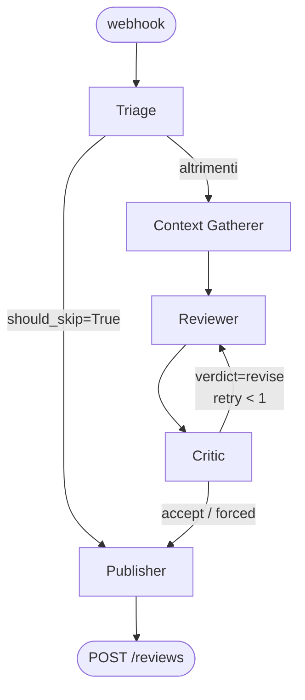
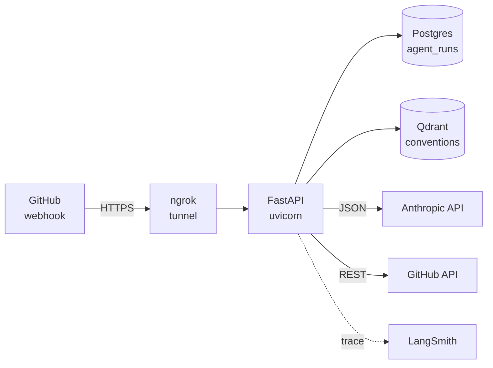

# PR Review Agent

> Agente LangGraph production-shape che fa code review su Pull Request GitHub. Tool-calling, memoria persistente delle convenzioni del progetto, critic loop, annotazioni inline reali via GitHub Reviews API.

[English 🇬🇧](./README.md) — [SPEC](./SPEC.md) — [SETUP](./SETUP.md) — [CLAUDE.md](./CLAUDE.md)


---

## Cosa fa

Quando un developer apre o aggiorna una Pull Request su un repo dove la GitHub App è installata, il bot riceve un webhook ed esegue una pipeline di review autonoma:

1. **Triage** classifica la PR (`change_type`, `risk_level`, eventuale skip).
2. **Context Gatherer** esplora il diff e il codebase tramite un set di tool (`get_pr_diff`, `read_file`, `list_directory`, `search_code`, `get_linked_issues`, `recall_conventions`), iterando fino a 15 tool call.
3. **Reviewer** produce un `ReviewResult` strutturato (commento generale + commenti inline ancorati a file/riga + raccomandazione di approvazione), routando le PR ad alto rischio su Opus 4.7 e le altre su Sonnet 4.6.
4. **Critic** esegue una validazione deterministica delle line numbers + un giudizio LLM (Haiku 4.5) su tone, severity e scope. Se il verdetto è `revise`, rimanda la draft al Reviewer per un retry.
5. **Publisher** pubblica la review finale su GitHub via `POST /pulls/{n}/reviews`, con commenti inline ancorati. Fallback su issue comment singolo in caso di errore API (es. 422 anchor non valido).

Una review tipica impiega ~30-90 secondi e costa **$0.08–0.09**.

## Demo

> 🎬 Walkthrough da 90 secondi — *in arrivo con W4-Task5 (registrazione in corso).*

Nel frattempo, un esempio reale di review che il bot ha prodotto su una PR di smoke-test con bug deliberato (`ZeroDivisionError` non gestito): [PR #2 sul playground](https://github.com/FrancescoMain/pr-review-agent-playground/pull/2). Il bot ha correttamente:

- Classificato come `feature` / `low risk`
- Flaggato sia `divide(a, b=0)` che `percent_change(0, new)` come `[issue]` ⚠️ con suggerimenti di codice
- Suggerito di aggiungere test `pytest.raises` per il caso zero al denominatore
- Selezionato `request_changes` come livello di approvazione

## Architettura

### Grafo dell'agente



| Nodo | Modello | Scopo |
|---|---|---|
| **Triage** | Haiku 4.5 | Classifica e decide se la PR vale una review |
| **Context Gatherer** | Sonnet 4.6 | Esplora il codebase via tool; produce un `GatheredContext` |
| **Reviewer** | Sonnet 4.6 (Opus 4.7 se `risk=high`) | Genera un `ReviewResult` strutturato |
| **Critic** | Haiku 4.5 | QA pass: scarta gli anchor allucinati, chiede revise se la qualità è bassa |
| **Publisher** | — | Posta su GitHub Reviews API con annotazioni inline |

### Topologia di deploy



## Quick start

Requisiti: Python 3.12+, [uv](https://docs.astral.sh/uv/), Docker (per Postgres + Qdrant), una GitHub App con webhook e private key, una API key Anthropic.

```bash
git clone https://github.com/FrancescoMain/pr-review-agent
cd pr-review-agent
uv sync
cp .env.example .env  # compila i valori reali
docker compose up -d  # postgres su :5433, qdrant su :6333
uv run uvicorn pr_review_agent.main:app --port 8001

# in un'altra shell, esponi localmente a GitHub
ngrok http 8001 --domain=<tuo-dominio-statico>
```

Apri una PR su un repo dove l'App è installata; la review appare in ~60s.

Vedi [SETUP.md](./SETUP.md) per il walkthrough completo della GitHub App (creazione App, webhook URL, installazione, dominio statico ngrok).

## Deploy

Il repo include un `Dockerfile` multi-stage e una guida step-by-step per andare in produzione:

- **[docs/deploy-railway.md](./docs/deploy-railway.md)** — Railway + Qdrant Cloud, setup ~30 min, ~$10/mese + spesa Anthropic per-PR.

Settings accetta la private key della GitHub App come file path (dev locale) oppure inline via `GITHUB_APP_PRIVATE_KEY_PEM` (secret Railway/Fly) — il resolver preferisce l'inline. Stessa image gira tale e quale su Fly.io, Render o un host tuo.

## Costi

Numeri da run end-to-end reali su PR Python piccole (≈20 righe modificate, 1 file):

| Stage | Modello | Token (in/out) | Costo |
|---|---|---|---|
| Triage | Haiku 4.5 | ~1.1K / 70 | $0.0015 |
| Gatherer + Reviewer | Sonnet 4.6 | ~17K / 2K | $0.08 |
| Critic | Haiku 4.5 | ~3K / 200 | $0.005 |
| **Totale tipico** | | **~21K / 2.3K** | **~$0.085** |

Un cost cap configurabile (`COST_CAP_PER_PR_USD`, default **$0.50**) abortisce il run con un commento se una singola review supera la soglia.

## Cosa c'è dentro

**Settimana 1 — scaffolding**
- FastAPI async + Pydantic Settings + structlog
- GitHub App auth (JWT RS256 + cache installation token con `asyncio.Lock`)
- Verifica firma webhook (HMAC-SHA256)
- Docker Compose con Postgres 17 + Qdrant 1.13
- LangSmith auto-tracing + GitHub Actions CI (ruff + pyright + pytest)

**Settimana 2 — agent core**
- 5 nodi LangGraph (triage → gatherer → reviewer → publisher) con tool calling completo
- 6 tool: `get_pr_diff`, `get_linked_issues`, `read_file`, `list_directory`, `search_code`, `recall_conventions`
- `RepoCheckout` shallow per-PR (clone-on-demand, cleanup-on-exit)
- Reviewer con `with_structured_output(ReviewResult)`, model routing per rischio
- Review reali via GitHub Reviews API con anchor inline validati contro il diff
- Persistenza run/cost su Postgres (`agent_runs`, migrazioni SQL idempotenti)
- Correlation ID (X-GitHub-Delivery) propagati a log e metadata LangSmith

**Settimana 3 — guardrails + memoria**
- Cost cap (live) con abort graceful + status `aborted_cost`
- Idempotency webhook: `X-GitHub-Delivery` duplicato → 202 senza dispatch
- Rate-limit guardrail reattivo su GitHub API (sleep entro 60s, abort oltre)
- Memoria convenzioni Qdrant: ingest CLI + tool `recall_conventions` con `BAAI/bge-small-en-v1.5`
- Nodo Critic con validazione deterministica + giudizio Haiku, retry edge (≤1)
- Eval harness con asserts rule-based + scoring LLM-as-judge Haiku

## Limiti / known issues

- **Single repo per installation oggi.** Lo schema DB è multi-tenant ready; il runner non è ancora hardenato per molte PR concorrenti da molte installation.
- **Ingest convenzioni manuale.** Lanci `python -m pr_review_agent.scripts.ingest_conventions` una volta per repo. Auto-trigger sul primo webhook è W5.
- **Critic retry capped a 1.** Due retry raramente migliorano la qualità al budget attuale.
- **Eval dataset con 3 case seed.** Crescerà a 20 durante W4.
- **Niente auto-rerun su failure.** I redelivery di GitHub colpiscono l'idempotency guard; il developer pusha un nuovo commit per riprovare.
- **Cost tracking globale per run.** Niente breakdown per nodo (ancora) fuori da LangSmith.

## Deviazione Anthropic-only

Lo SPEC §1 originale lascia spazio a OpenAI come fallback LLM e Voyage / Cohere / OpenAI per gli embeddings. Questa implementazione usa deliberatamente **solo Anthropic** per gli LLM (Haiku 4.5, Sonnet 4.6, Opus 4.7) e **solo `sentence-transformers` con `BAAI/bge-small-en-v1.5`** in locale per gli embeddings. Il razionale è in [`CLAUDE.md`](./CLAUDE.md): integrazione Anthropic-native pulita senza dipendenze cloud per gli embedding, calzante per il posizionamento sul mercato italiano AI Agent Developer.

## Stack tecnologico

Python 3.12+ · `uv` · LangGraph · LangChain (Anthropic) · FastAPI async · Pydantic v2 · `asyncpg` · Qdrant · `sentence-transformers` · `httpx` · `structlog` · `respx` · pytest + pytest-asyncio · ruff · pyright (strict).

## Struttura del progetto

```
src/pr_review_agent/
├── agent/
│   ├── nodes/         # triage, context_gatherer, reviewer, critic, publisher
│   ├── tools/         # github_tools, filesystem_tools, convention_tools, repo_checkout
│   ├── memory/        # chunker, embedder, ConventionStore (Qdrant)
│   ├── prompts/       # *.md system prompt per nodo
│   ├── models.py      # schema Pydantic (TriageDecision, ReviewResult, CriticVerdict, ...)
│   ├── state.py       # AgentState TypedDict
│   ├── graph.py       # LangGraph build_graph
│   └── runner.py      # wiring di produzione
├── github/            # client, auth, signatures, diff_parser, exceptions
├── db/                # asyncpg pool + repository agent_runs
├── scripts/           # CLI ingest_conventions
├── observability/     # logging + correlation
├── webhook.py         # route FastAPI + idempotency check
└── main.py            # app + lifespan
eval/                  # eval harness offline (W3-Task7)
bruno/                 # collection di API testing
docs/testing/          # guide testing manuale per task (italiano)
migrations/            # SQL idempotente
tests/unit/            # 227 test unit, tutti offline
```

## Documentazione

- **[SPEC.md](./SPEC.md)** — specifica completa: architettura, schemi, evaluation, observability.
- **[SETUP.md](./SETUP.md)** — setup environment (uv, GitHub App, ngrok, API keys, .env.example).
- **[CLAUDE.md](./CLAUDE.md)** — briefing operativo per Claude Code: convenzioni di sviluppo e deviazioni dallo spec originale.
- **[docs/testing/](./docs/testing/)** — guide testing manuale per task (italiano, tono narrativo).
- **[docs/demo-recording-guide.md](./docs/demo-recording-guide.md)** — come registrare il video demo da 90 secondi.

## Roadmap

- ✅ **Settimana 1** — scaffolding + hello-world end-to-end (chiusa 2026-05-05)
- ✅ **Settimana 2** — tool calling, review reali, persistenza, observability (chiusa 2026-05-06)
- ✅ **Settimana 3** — guardrails (cost cap, idempotency, rate limit), memoria (Qdrant), critic + retry, eval harness (chiusa 2026-05-06)
- 🔄 **Settimana 4** — deploy su Railway/Fly.io, eval su 20 PR, video demo, README polished, esposizione opzionale MCP

## Licenza

Rilasciato sotto [MIT License](./LICENSE).

## Contatti

[Francesco Cesarano](mailto:cesaranofrancescomain@gmail.com) — AI Agent Developer.
