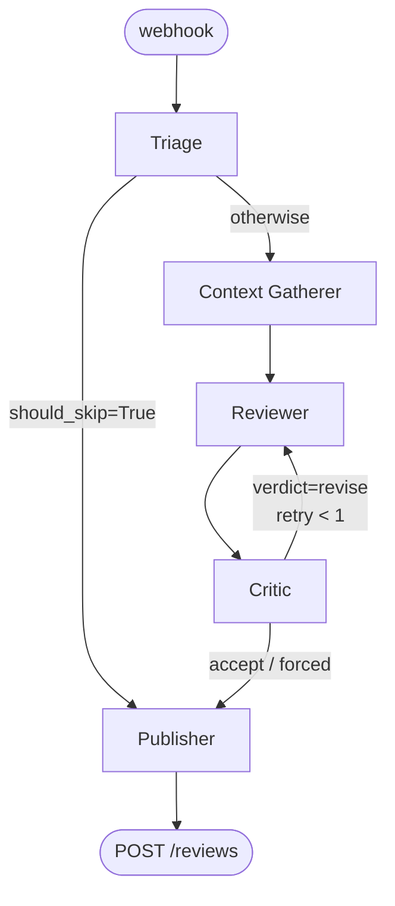
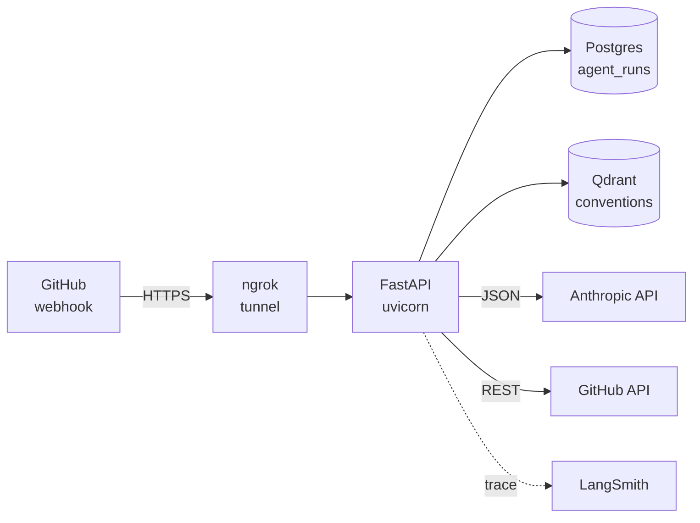

# PR Review Agent

> Production-shape LangGraph agent that performs code review on GitHub Pull Requests. Tool-calling, persistent project memory, critic loop, real inline annotations via GitHub Reviews API.

[Italiano 🇮🇹](./README.it.md) — [SPEC](./SPEC.md) — [SETUP](./SETUP.md) — [CLAUDE.md](./CLAUDE.md)


---

## What it does

When a developer opens or updates a Pull Request on a repo where this GitHub App is installed, the bot receives a webhook and runs an autonomous review pipeline:

1. **Triage** classifies the PR (change_type, risk_level, whether to skip).
2. **Context Gatherer** explores the diff and the codebase via a small set of tools (`get_pr_diff`, `read_file`, `list_directory`, `search_code`, `get_linked_issues`, `recall_conventions`), iterating up to 15 tool calls.
3. **Reviewer** produces a structured `ReviewResult` (overall comment + inline comments anchored to specific files/lines + approval recommendation), routing high-risk PRs to Opus 4.7 and others to Sonnet 4.6.
4. **Critic** runs a deterministic line-number validation pass plus an LLM-judgement pass (Haiku 4.5) on tone, severity, and scope. If the verdict is `revise` it sends the draft back to the Reviewer for one retry.
5. **Publisher** posts the final review to GitHub via `POST /pulls/{n}/reviews`, with line-anchored inline comments. Falls back to a single issue comment on API errors (e.g. 422 stale anchor).

A typical PR review takes ~30-90 seconds and costs **$0.08–0.09**.

## Demo

> 🎬 90-second walkthrough — *coming with W4-Task5 (recording in progress).*

In the meantime, an example real review the bot produced on a smoke-test PR with a deliberate bug (`ZeroDivisionError` un-guarded): [PR #2 on the playground](https://github.com/FrancescoMain/pr-review-agent-playground/pull/2). The bot correctly:

- Classified as `feature` / `low risk`
- Flagged both `divide(a, b=0)` and `percent_change(0, new)` as `[issue]` ⚠️ with code suggestions
- Suggested adding `pytest.raises` tests for the zero-denominator case
- Selected `request_changes` as the approval level

## Architecture

### Agent graph



| Node | Model | Purpose |
|---|---|---|
| **Triage** | Haiku 4.5 | Classify and decide whether the PR is worth reviewing at all |
| **Context Gatherer** | Sonnet 4.6 | Explore the codebase via tools; output a `GatheredContext` |
| **Reviewer** | Sonnet 4.6 (Opus 4.7 if `risk=high`) | Produce a structured `ReviewResult` |
| **Critic** | Haiku 4.5 | QA pass: drop hallucinated anchors, request revise if quality is low |
| **Publisher** | — | Post to GitHub Reviews API with inline annotations |

### Deployment topology



## Quick start

Requirements: Python 3.12+, [uv](https://docs.astral.sh/uv/), Docker (for Postgres + Qdrant), a GitHub App with webhook + a private key, an Anthropic API key.

```bash
git clone https://github.com/FrancescoMain/pr-review-agent
cd pr-review-agent
uv sync
cp .env.example .env  # fill in real values
docker compose up -d  # postgres on :5433, qdrant on :6333
uv run uvicorn pr_review_agent.main:app --port 8001

# in another shell, expose locally to GitHub
ngrok http 8001 --domain=<your-static-domain>
```

Open a PR on a repo where your App is installed; the review appears in ~60s.

See [SETUP.md](./SETUP.md) for the full GitHub App walkthrough (App creation, webhook URL, installation, ngrok static domain).

## Costs

Numbers from real end-to-end runs on small Python PRs (≈20 lines changed, 1 file):

| Stage | Model | Tokens (in/out) | Cost |
|---|---|---|---|
| Triage | Haiku 4.5 | ~1.1K / 70 | $0.0015 |
| Gatherer + Reviewer | Sonnet 4.6 | ~17K / 2K | $0.08 |
| Critic | Haiku 4.5 | ~3K / 200 | $0.005 |
| **Total typical** | | **~21K / 2.3K** | **~$0.085** |

A configurable cost cap (`COST_CAP_PER_PR_USD`, default **$0.50**) aborts the run with a comment if any single review goes over.

## What's in the box

**Week 1 — scaffolding**
- FastAPI async + Pydantic Settings + structlog
- GitHub App auth (JWT RS256 + installation token cache with `asyncio.Lock`)
- Webhook signature verification (HMAC-SHA256)
- Docker Compose with Postgres 17 + Qdrant 1.13
- LangSmith auto-tracing + GitHub Actions CI (ruff + pyright + pytest)

**Week 2 — agent core**
- 5 LangGraph nodes (triage → gatherer → reviewer → publisher) with full tool calling
- 6 tools: `get_pr_diff`, `get_linked_issues`, `read_file`, `list_directory`, `search_code`, `recall_conventions`
- Shallow per-PR `RepoCheckout` (clone-on-demand, cleanup-on-exit)
- Reviewer with `with_structured_output(ReviewResult)`, model routing on risk
- Real PR reviews via GitHub Reviews API with inline anchors validated against the diff
- Postgres-backed run/cost persistence (`agent_runs` table, idempotent SQL migrations)
- Correlation IDs (X-GitHub-Delivery) propagated to logs and LangSmith metadata

**Week 3 — guardrails + memory**
- Cost cap (live) with graceful abort + `aborted_cost` status
- Webhook idempotency: duplicate `X-GitHub-Delivery` returns 202 without dispatching
- Reactive GitHub API rate-limit guardrail (sleep within 60s, abort beyond)
- Qdrant convention memory: ingest CLI + `recall_conventions` tool with `BAAI/bge-small-en-v1.5`
- Critic node with deterministic line-number validation + Haiku judgement, retry edge (≤1)
- Eval harness with rule-based asserts + Haiku-as-judge LLM scoring

## Limits / known issues

- **Single repo per installation right now.** The DB schema is multi-tenant ready; the runner just hasn't been hardened for many concurrent PRs from many installations.
- **Convention ingest is manual.** You run `python -m pr_review_agent.scripts.ingest_conventions` once per repo. Auto-trigger on first webhook is W5.
- **Critic retry capped at 1.** Two retries rarely improve quality at our budget.
- **Eval dataset has 3 seed cases.** Will grow to 20 during W4.
- **No auto-rerun on failure.** GitHub redeliveries hit the idempotency guard; the developer pushes a new commit to retry.
- **Cost tracking is global per run.** No per-node breakdown surfaced (yet) outside LangSmith.

## Anthropic-only deviation

The original SPEC §1 leaves room for OpenAI as an LLM fallback and Voyage / Cohere / OpenAI for embeddings. This implementation deliberately **only uses Anthropic** for LLMs (Haiku 4.5, Sonnet 4.6, Opus 4.7) and **only `sentence-transformers` with `BAAI/bge-small-en-v1.5`** locally for embeddings. The reasoning is in [`CLAUDE.md`](./CLAUDE.md): clean Anthropic-native integration without cloud-embedding dependencies, suited to the Italian AI Agent Developer market positioning.

## Tech stack

Python 3.12+ · `uv` · LangGraph · LangChain (Anthropic) · FastAPI async · Pydantic v2 · `asyncpg` · Qdrant · `sentence-transformers` · `httpx` · `structlog` · `respx` · pytest + pytest-asyncio · ruff · pyright (strict).

## Project structure

```
src/pr_review_agent/
├── agent/
│   ├── nodes/         # triage, context_gatherer, reviewer, critic, publisher
│   ├── tools/         # github_tools, filesystem_tools, convention_tools, repo_checkout
│   ├── memory/        # chunker, embedder, ConventionStore (Qdrant)
│   ├── prompts/       # *.md per-node system prompts
│   ├── models.py      # Pydantic schemas (TriageDecision, ReviewResult, CriticVerdict, ...)
│   ├── state.py       # AgentState TypedDict
│   ├── graph.py       # LangGraph build_graph
│   └── runner.py      # production wiring
├── github/            # client, auth, signatures, diff_parser, exceptions
├── db/                # asyncpg pool + agent_runs repository
├── scripts/           # ingest_conventions CLI
├── observability/     # logging + correlation
├── webhook.py         # FastAPI route + idempotency check
└── main.py            # app + lifespan
eval/                  # offline eval harness (W3-Task7)
bruno/                 # API testing collection
docs/testing/          # per-task manual testing guides (italian)
migrations/            # idempotent SQL
tests/unit/            # 227 unit tests, all offline
```

## Documentation

- **[SPEC.md](./SPEC.md)** — full project specification: architecture, schemas, evaluation, observability.
- **[SETUP.md](./SETUP.md)** — environment setup (uv, GitHub App, ngrok, API keys, .env.example).
- **[CLAUDE.md](./CLAUDE.md)** — operational briefing for Claude Code: development conventions and deviations from the original spec.
- **[docs/testing/](./docs/testing/)** — manual testing guides per task (Italian, narrative tone).
- **[docs/demo-recording-guide.md](./docs/demo-recording-guide.md)** — how to record the 90-second demo video.

## Roadmap

- ✅ **Week 1** — scaffolding + hello-world end-to-end (closed 2026-05-05)
- ✅ **Week 2** — tool calling, real reviews, persistence, observability (closed 2026-05-06)
- ✅ **Week 3** — guardrails (cost cap, idempotency, rate limit), memory (Qdrant), critic + retry, eval harness (closed 2026-05-06)
- 🔄 **Week 4** — deploy on Railway/Fly.io, eval on 20 PRs, demo video, polished README, optional MCP exposure

## License

Open for portfolio review. License will be set explicitly before any external use.

## Contact

[Francesco Cesarano](mailto:cesaranofrancescomain@gmail.com) — AI Agent Developer.
